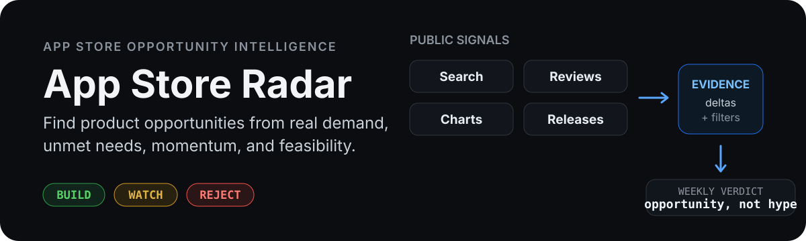

<p align="center">
  
</p>

# App Store Radar

Find product opportunities from **real App Store demand, unmet needs, market momentum, and build feasibility — not popularity alone**.

App Store Radar turns public App Store signals into a weekly `BUILD / WATCH / REJECT` report for product discovery.

## What it looks for

```text
Demand
  ↓
Supply gap
  ↓
Momentum
  ↓
Feasibility
  ↓
BUILD / WATCH / REJECT
```

The radar combines multiple signals before promoting an opportunity:

- rating and review acceleration;
- chart movement;
- release velocity;
- search presence;
- recurring review gaps across multiple apps;
- persistence over time;
- feasibility and plausible economics.

A single spike is not enough. Weak or contradictory evidence stays in `WATCH` or is rejected.

## How it works

```text
Apple public App Store sources
          ↓
Daily evidence snapshots
          ↓
Historical deltas + noise filtering
          ↓
Weekly opportunity research
          ↓
BUILD / WATCH / REJECT
```

The baseline pipeline collects public Search, Lookup, Reviews, and Charts data for the US, China, and Japan storefronts. Daily snapshots are stored in Git so changes can be measured over time instead of inferred from one-off rankings.

## Evidence guardrails

- Search ordering is stored as `discovery_position`; it is **not** treated as the real iPhone App Store keyword rank.
- Rating and review momentum are adoption proxies; they are **not** download or revenue estimates.
- Missing source data is recorded as missing evidence, never interpreted as zero demand.
- Version incidents and other obvious short-lived spikes are filtered before opportunity promotion.
- A weekly report may contain **zero opportunities**. Silence is better than weak evidence.

## Run locally

Requires Node.js 22+.

```bash
npm test
npm run collect -- --date 2026-09-08
npm run weekly -- --date 2026-09-08
```

No database, dashboard, paid API, or secret is required for the baseline pipeline.

## Automation

The unattended pipeline has two responsibilities:

- **GitHub Actions** runs daily collection to build the historical evidence base and runs CI on pull requests and `main`.
- **ChatGPT** runs the weekly opportunity research: it reads the accumulated evidence, performs external validation and counter-evidence checks, updates the weekly report, opens a PR, verifies CI, and merges only validated changes.

Daily collection can also be started manually with `workflow_dispatch`.

## Data

```text
data/YYYY/MM/DD/        daily evidence partitions
evidence/YYYY-Www.json  weekly machine-readable evidence
reports/YYYY-Www.md     weekly human-readable report
```
